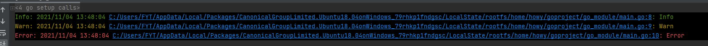

# llog
本地彩色打印 方便调试 llog


```golang
package main

import "github.com/zhenghaoyang/llog"

func main() {
   llog.SetLevel("Info")// debug等级将被忽略
   //设置打印到文件，默认输出控制台
   //llog.SetTypeFile("log.txt")
   llog.Debug("Debug")
   llog.Info("Info")
   llog.Warn("Warn")
   llog.Error("Error")
}
```
## 打印效果


